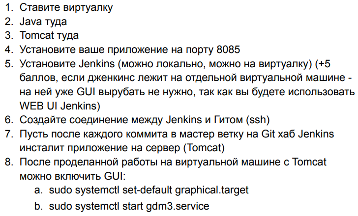

# App for Jenkins

Домашнее задание на стажировке в компании Aston.

Выполнено в полном объёме. Настроен webhook, при обновлении репозитория приходит оповещение в настроенный job.
Jenkins откликается, собирает проект, устанавливает на Tomcat по адресу http://localhost:8085/app-for-jenkins. 